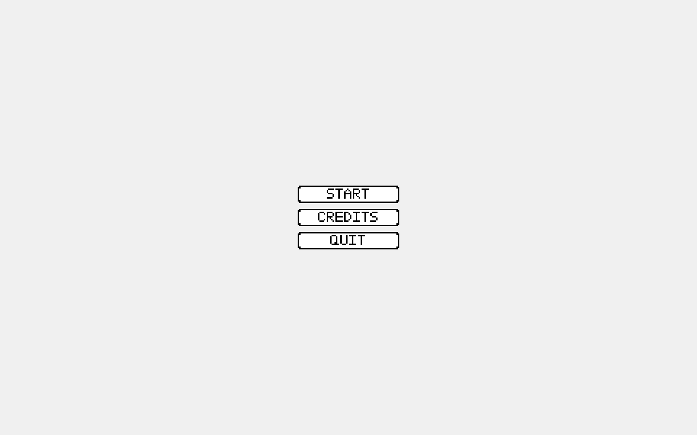
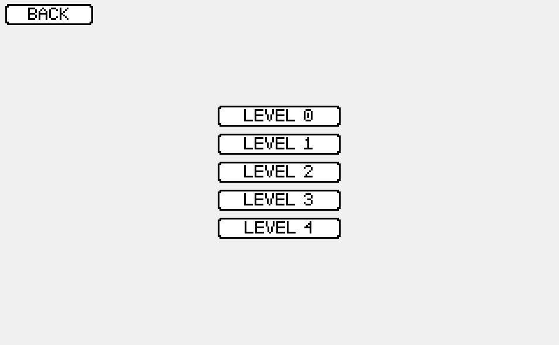
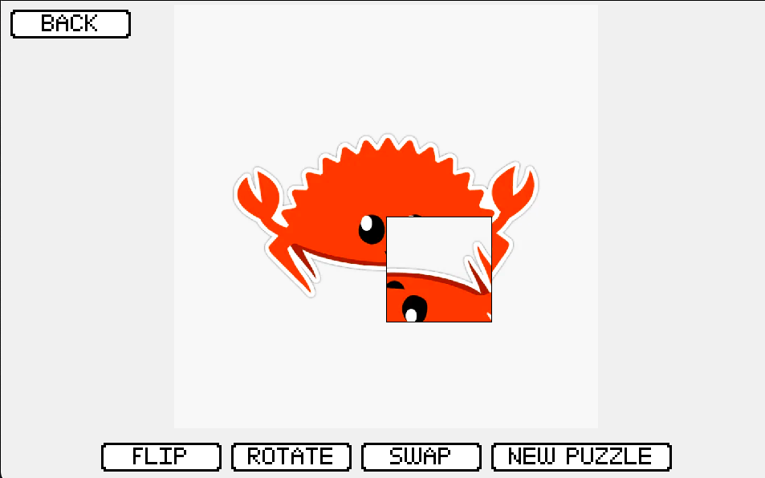
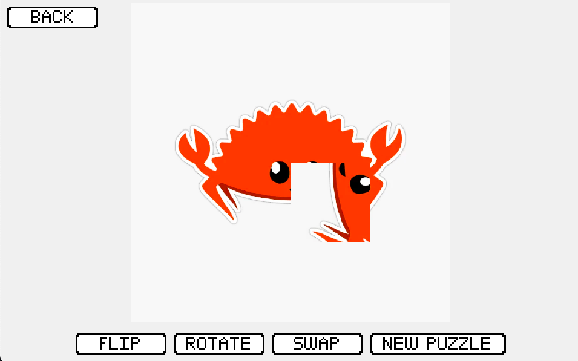
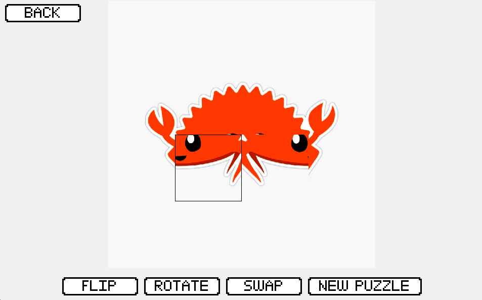
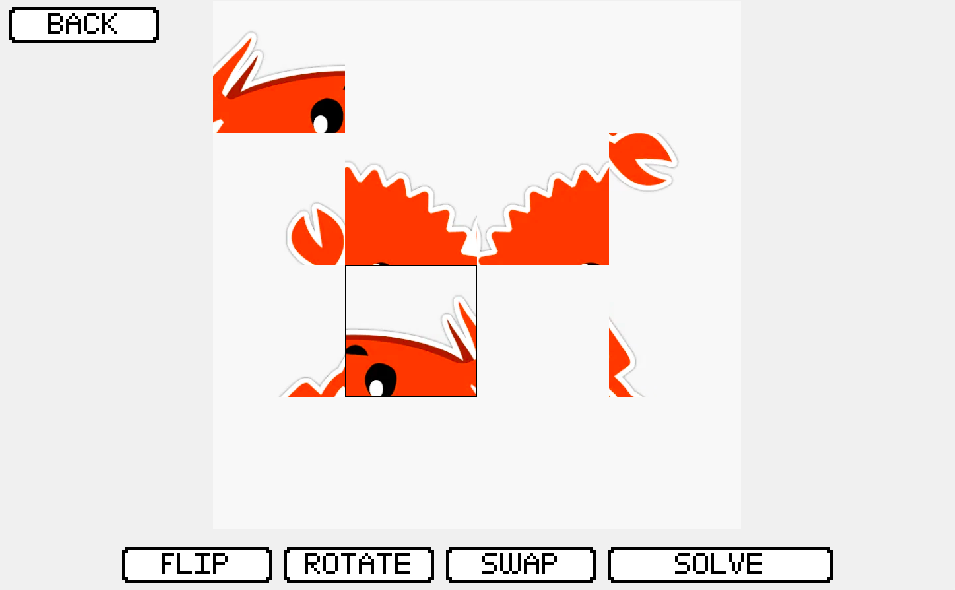

# Code Jam 10
# Team: The Monkey Patches

## Team Members
- @bast0006 (.bast.)
- ~~@Chara98 (chara98)~~ (Dropped out)
- ~~@Ethan-Mr-Hunt (brucewayne2800)~~ (Dropped out)
- @FieryIceStickie (fieryicestickie)
- @LioQing (lioqing)
- @mache102 (segtwo)


## What does our project do?

Our project is a short puzzle game where you receive a scrambled image and you have to modify the image using some predefined operations to uncover the original image (the secret code).
We have a selection of 5 images to choose from, in increasing order of difficulty to solve.

## How do I use it?

To run the app, clone the repository and run
```shell
python3 -m main.main
```

When you first open the app, you will be greeted by the start screen. Select "Start" to start playing the game.


Then, pick a level from 0-4, with 4 being the most difficult.


You will see an image. Click "New Puzzle" to scramble the puzzle, and then you can start solving it.

There are 4 buttons you can choose from:
1. Flip: Flip the selected tile horizontally. If you want to flip a tile vertically, then you can flip and then rotate twice. This can also be done by pressing 'Q'.

2. Rotate: Rotate the selected tile 90° clockwise. This can also be done by pressing 'W'.

3. Swap: Swap the currently selected tile and previously selected tile.

4. New Puzzle/Solve: If it says "New Puzzle", then you can click it to scramble the image. If it says solve, then clicking it will solve the puzzle and let you generate a new one.


If the puzzle remains scrambled, even after pressing "Solve", then back out and reenter the level.

## How does it work?
Pygame was used for the GUI, while numpy was used for the image processing operations. While Pillow was used to edit the images used in the levels, it isn't used in the final product, as numpy can interface directly with pygame.

When the app starts, the images for each level are loaded along with their tile sizes. When buttons are pressed to modify the image, an array view of the image pixels, arranged in tiles, is modified inplace, which changes the pygame surface and thus the image.

All text for the GUI is generated dynamically, using numpy to convert text into a pixel array, and then mapping that onto a pygame surface to be displayed.

## Contributions
- Bast: Contributed to the development of the GUI, having created aspects like the text rendering for the game text. Also created the functions for randomly shuffling the image tiles.
- Stickie: Contributed to the numpy functions for each image operation, and provided the images for each level. Also wrote this readme :)
- LioQing: Contributed to the development of the GUI, writing a lot of the essential pygame code for the GUI. Also made the credits.
- Segtwo: Managed the project, and kept track of the ideas involved in the project. Wrote docs.md for developer documentation, and also worked on the image operation functions.
